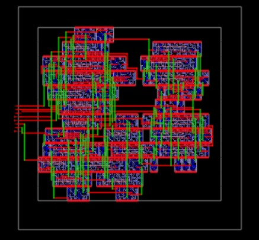
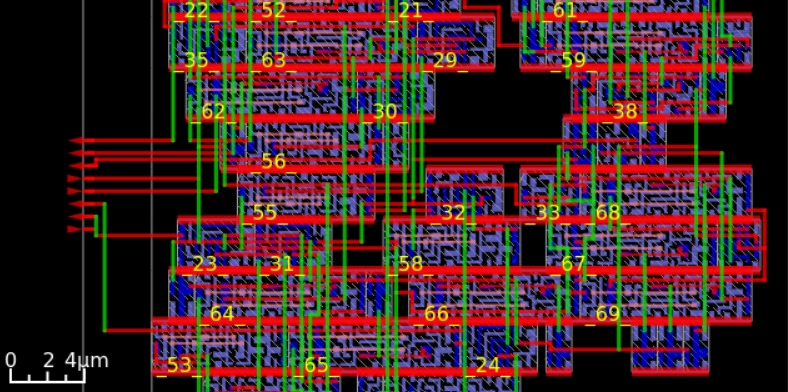

<div align="center">

#  SPI Slave — RTL to GDSII
### Full Physical Design Implementation on SkyWater 130nm

[](https://github.com/google/skywater-pdk)
[](https://github.com/The-OpenROAD-Project/OpenROAD)
[]()
[]()

*A complete RTL-to-GDSII implementation of a custom SPI Slave Node — from behavioral Verilog to a fully routed silicon layout.*

</div>

---

## What is this?

SPI (Serial Peripheral Interface) is one of the most widely used communication protocols in embedded systems — enabling synchronous, full-duplex data exchange between a master controller and peripherals like sensors, ADCs, displays, and flash memory.

This project implements the **slave-side silicon block** — taken all the way from RTL description through synthesis, placement, routing, and clock tree construction to a final GDSII file ready for fabrication.

---

## Toolchain

```
Behavioral Verilog
       │
       ▼
  Yosys (Synthesis)
       │  Maps RTL → Sky130 standard cell library
       ▼
  OpenROAD (Floorplan → Placement → Routing)
       │  Automated place-and-route
       ▼
  TritonCTS (Clock Tree Synthesis)
       │  Balanced clock distribution
       ▼
  GDSII Layout
```

| Stage | Tool | Purpose |
|---|---|---|
| Synthesis | Yosys | RTL → gate-level netlist |
| Floorplanning / PnR | OpenROAD | Physical implementation |
| Clock Tree | TritonCTS | Skew minimization |
| Process Node | SkyWater SKY130B | 130nm open-source PDK |

---

## Repository Structure

```
spi-slave-sky130/
├── rtl/
│   └── spi_slave.v                  # Behavioral Verilog source
├── constraints/
│   └── spi_slave.sdc                # Timing constraints (SDC)
├── config/
│   └── config.json                  # OpenROAD flow configuration
├── results/
│   ├── synthesis/
│   │   └── spi_slave.synth.v        # Post-synthesis netlist
│   ├── floorplan/
│   ├── placement/
│   ├── cts/
│   ├── routing/
│   └── final/
│       ├── spi_slave.gds            # Final GDSII layout
│       └── spi_slave.lef            # Layout Exchange Format
├── reports/
│   ├── timing/
│   │   ├── setup.rpt                # STA setup report
│   │   └── hold.rpt                 # STA hold report
│   └── utilization.rpt              # Core utilization report
├── screenshots/
│   ├── whole_spi.png                # Full die layout view
│   └── zoomed_spi.png               # Zoomed cell-level view
└── README.md
```

---

## Implementation Details

### Synthesis & Floorplanning
Behavioral Verilog was synthesized and mapped to the Sky130 standard cell library via Yosys. The physical core was constrained to a **42 × 42 µm** bounding box, achieving **54% core utilization** — a density that balances area efficiency with sufficient routing track headroom to prevent congestion.

> 💡 *54% is the practical sweet spot for OpenROAD on Sky130 — high enough to be area-efficient, low enough for the router to find clean paths without detour inflation blowing up timing.*

### Clock Tree Synthesis
TritonCTS constructed a balanced clock distribution network using dedicated `__clkbuf_` cells, minimizing skew across all pipeline registers and maintaining pulse integrity at every sequential element input.

### Power Distribution Network
A structured PDN was implemented with VDD/VSS straps across metal layers, maintaining IR drop within acceptable margins throughout the core area.

---

## Post-Layout Results

### Static Timing Analysis — Worst-Case Corner

| Metric | Value | Notes |
|---|---|---|
| Target Clock Period | 10.00 ns | 100 MHz SDC constraint |
| **Setup Slack (WNS)** | **+8.37 ns** | ~4.7× headroom over target |
| **Hold Slack** | **+0.15 ns** | Met without aggressive buffering |
| **TNS** | **0.00 ns** | Zero violations across full netlist |
| Estimated F<sub>max</sub> | ~500 MHz | Near Sky130 process ceiling |

### Physical Metrics

| Metric | Value |
|---|---|
| Die Area | 42 × 42 µm |
| Core Utilization | 54% |
| DRC Sign-off | 🔄 In Progress |
| LVS Sign-off | 🔄 In Progress |
| Power Analysis | 🔄 In Progress |

---

## 🖼️ Layout

### Full Die View


### Zoomed Cell-Level View


*🔴 Red: M2/M3 routing layers · 🟢 Green: M1 / local interconnect · 🔵 Blue: diffusion / poly · Scale: 0–4 µm*

---

## How to Reproduce

### Prerequisites
- [OpenROAD-flow-scripts](https://github.com/The-OpenROAD-Project/OpenROAD-flow-scripts)
- SkyWater SKY130B PDK (via `volare` or manual install)
- Yosys, Magic, Netgen

### Run the Flow
```bash
git clone https://github.com/dhruv050406/spi-slave-sky130
cd spi-slave-sky130

# From your OpenROAD-flow-scripts installation
make DESIGN_CONFIG=./config/config.json
```

### View the Layout
```bash
# Open final GDS in Magic
magic -T $PDK_ROOT/sky130A/libs.tech/magic/sky130A.tech \
      results/final/spi_slave.gds
```

---

## Key Takeaways

Getting clean timing closure out of OpenROAD requires precise alignment between SDC constraints, Liberty timing files, and floorplan decisions — simultaneously. The automated flow surfaces problems in each layer independently, and iterating through them is where the real learning happens.

The 54% utilization was not arbitrary — it was arrived at through multiple floorplan iterations to find the density at which the router could close timing without congestion-driven detours inflating critical path delays.

---

## Roadmap

- [x] RTL Design & Synthesis
- [x] Floorplanning & Placement
- [x] Clock Tree Synthesis
- [x] Detailed Routing
- [x] Static Timing Analysis — Clean
- [ ] DRC Sign-off (Magic)
- [ ] LVS Sign-off (Netgen)
- [ ] Power Analysis

---

<div align="center">

**Dhruv Pradhan** · Electrical & Electronics Engineering, VIT, Vellore (2024–2028)

Electrical & Embedded Systems Engineer, Team RoverX · RTL / FPGA / ASIC Design

[](https://www.linkedin.com/in/dhruvp546/)
[](https://github.com/dhruv050406)

</div>
